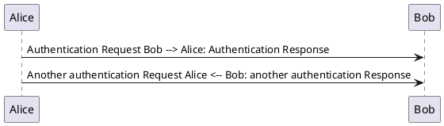

Java
https://gitlab.com/graphviz/graphviz/ (brew install graphviz on macos)

### Editing in VSCode

https://marketplace.visualstudio.com/items?itemName=jebbs.plantuml

### Using with Pandoc

https://github.com/plantuml/plantuml
https://github.com/pandoc/lua-filters/tree/master/plantuml
