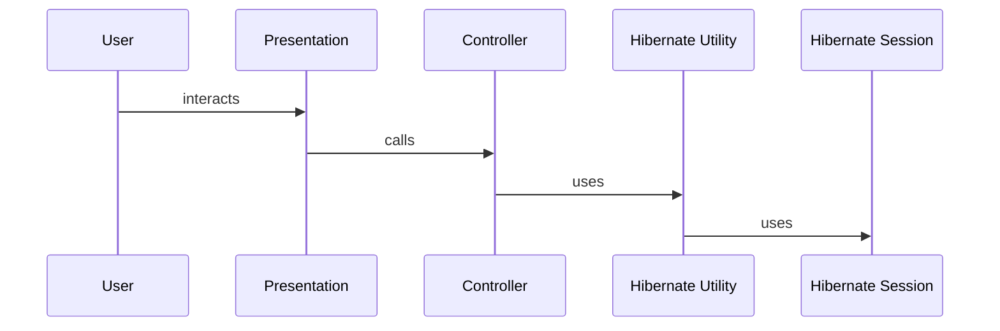

# Hibernate 2

## The ideal persistence mechanism

Ideally&mdash;if memory was non-volatile and limitless&mdash;objects would not need to be persisted. Creating objects and establishing associations would suffice. A system would be a soup of objects and not have to bother about external persistence.

## O/R mapping

The closest we get to ideal persistence is by using an O/R mapping framework such as [Hibernate 2](http://sourceforge.net/projects/hibernate/files/hibernate2/), that persists object state to a relational database.

The following steps are typically performed when a user interacts with a data entry use case

* Create new transient objects, or query existing persistent objects
* Begin a transaction
* Change object properties and associations
* Save objects to persistent storage
* Commit the transaction

## A simple persistence framework using Hibernate

Let us start with a diagram to understand how the persistence framework uses Hibernate.



One or more use cases are orchestrated by a controller object. Each method of a controller object may initiate a new database transaction, or participate in an existing one. The controller saves and retrieves persistent objects using the `HibernateUtil` class, that in turn uses Hibernate's Session object.

```java
import java.io.Serializable;
import java.lang.reflect.Method;
import java.net.URL;
import java.util.Date;
import java.util.Iterator;
import java.util.List;
import java.util.Map;

import net.sf.cglib.proxy.Enhancer;
import net.sf.cglib.proxy.MethodInterceptor;
import net.sf.cglib.proxy.MethodProxy;
import net.sf.hibernate.CallbackException;
import net.sf.hibernate.HibernateException;
import net.sf.hibernate.Interceptor;
import net.sf.hibernate.LockMode;
import net.sf.hibernate.ObjectNotFoundException;
import net.sf.hibernate.ReplicationMode;
import net.sf.hibernate.Session;
import net.sf.hibernate.SessionFactory;
import net.sf.hibernate.Transaction;
import net.sf.hibernate.cfg.Configuration;
import net.sf.hibernate.metadata.ClassMetadata;
import net.sf.hibernate.type.Type;

/**
 * This utility class provides a simple framework for using Hibernate
 * by implementing some well known design patterns or by being
 * useful with some of these patterns:
 *  - Thread Local session
 *  - AspectJ Hibernate aspect
 *  - Root Persistent Class
 *
 * In conjunctions with CGLIB and the TransactionConfiguration class it allows
 * any class to be extended so that methods of it's instances are wrapped with
 * appropriate begin and commit transaction invocations. The transaction
 * requirement can specified in an external xml configuration file.
 *
 * @see net.sf.hibernate.Session
 * @see net.sf.hibernate.SessionFactory
 */
public final class HibernateUtil implements MethodInterceptor, Interceptor {
// methods in various code snippets below
}
```

## Persistent Objects

Persistent objects inherit from a common root class called `PersistentObject`, shown below.

```java
/**
 * Super-class of all basic / entity classes.
 */
public abstract class PersistentObject implements Serializable {
    // flag indicating that object is persistent / saved
    private boolean _saved = false; 

    /**
     * This method is called when the object is saved to persistent
     * storage.
     */
    public void onSave() {
        _saved = true;
    }

    /**
     * This method is called when the object is loaded from persistent
     * storage.
     */
    public void onLoad() {
        _saved = true;
    }

    /**
     * This method is used to discover the saved status of the object.
     *
     * @return True if the object is exists in persistent storage
     */
    public boolean isSaved() {
        return _saved;
    }
}
```

Hibernate Utility needs the `isSaved()` method to hint a hibernate session on whether an object is persistent. This is required in the special case where a child object has the primary key of the parent object and not a direct reference to it.

This is how the Hibernate utility&mdash;which needs to implement the Hibernate Interceptor interface&mdash;makes use of this method

```java
    /**
     * If the specified object is an instance of PersistentObject
     * sets the state of the object to saved.
     * @see net.sf.hibernate.Interceptor#onLoad(java.lang.Object,
     * java.io.Serializable, java.lang.Object[], java.lang.String[],
     * net.sf.hibernate.type.Type[])
     */
    public boolean onLoad(Object object, Serializable id, Object[] state,
            String[] propertyNames, Type[] types)
            throws CallbackException {

        if (object instanceof PersistentObject) {
            ( (PersistentObject) object ).onLoad();
        }
        return false; // we did not modify state
    }

    /**
     * If the specified object is an instance of AuditedPersistentObject
     * sets the dateLastUpdated attribute.
     */
    private boolean setDateLastUpdated(Object object, Object[] state,
            String[] propertyNames) {
        if (object instanceof AuditedPersistentObject) {
            for (int i = 0; i < propertyNames.length; i++) {
                if ("dateLastUpdated".equals(propertyNames[i])) {
                    state[i] = new Date();
                    return true;
                }
            }
        }
        return false; // we did not modify state
    }

    /**
     * @see net.sf.hibernate.Interceptor#onFlushDirty(java.lang.Object,
     * java.io.Serializable, java.lang.Object[], java.lang.Object[],
     * java.lang.String[], net.sf.hibernate.type.Type[])
     */
    public boolean onFlushDirty(Object object, Serializable id,
            Object[] currentState, Object[] previousState,
            String[] propertyNames, Type[] types)
            throws CallbackException {

        return setDateLastUpdated(object, currentState, propertyNames);
    }

    /**
     * @see net.sf.hibernate.Interceptor#onSave(java.lang.Object,
     * java.io.Serializable, java.lang.Object[], java.lang.String[],
     * net.sf.hibernate.type.Type[])
     */
    public boolean onSave(Object object, Serializable id, Object[] state,
            String[] propertyNames, Type[] types)
            throws CallbackException {

        boolean result = setDateLastUpdated(object, state, propertyNames);

        if (object instanceof PersistentObject) {
            ( (PersistentObject) object ).onSave();
        }

        return result;
    }

    /** (non-Javadoc)
     * @see net.sf.hibernate.Interceptor#onDelete(java.lang.Object,
     * java.io.Serializable, java.lang.Object[], java.lang.String[],
     * net.sf.hibernate.type.Type[])
     */
    public void onDelete(Object object, Serializable id, Object[] state,
            String[] propertyNames, Type[] types)
            throws CallbackException {
    }

    /** (non-Javadoc)
     * @see net.sf.hibernate.Interceptor#preFlush(java.util.Iterator)
     */
    public void preFlush(Iterator objects) throws CallbackException {

    }

    /** (non-Javadoc)
     * @see net.sf.hibernate.Interceptor#postFlush(java.util.Iterator)
     */
    public void postFlush(Iterator objects) throws CallbackException {

    }

    /**
     * If the object is a PersistentObject returns its saved status.
     * @return true if the PersistentObject already exists in the database.
     * @see net.sf.hibernate.Interceptor#isUnsaved(java.lang.Object)
     */
    public Boolean isUnsaved(Object object) {
        if (object instanceof PersistentObject) {
            return new Boolean( !( (PersistentObject) object ).isSaved() );
        } else {
            return null; // let Hibernate assume default behavior
        }
    }

    /**
     * @see net.sf.hibernate.Interceptor#findDirty(java.lang.Object,
     * java.io.Serializable, java.lang.Object[], java.lang.Object[],
     * java.lang.String[], net.sf.hibernate.type.Type[])
     */
    public int[] findDirty(Object object, Serializable id,
            Object[] currentState, Object[] previousState,
            String[] propertyNames, Type[] types) {
        return null; // let Hibernate assume default behavior
    }

    /**
     * @see net.sf.hibernate.Interceptor#instantiate(java.lang.Class,
     * java.io.Serializable)
     */
    public Object instantiate(Class classObj, Serializable id)
            throws CallbackException {
        Object object = null; // let Hibernate assume default behavior
        return object;
    }
```

Persistent objects that have composite keys must also override the `equals` and `hashCode` methods. The `equals` method must return `true` if the corresponding primary key attributes of two objects of the same class pass the `equals` test.

## Intercepting objects about to be saved

The `onSave` method, shown in the previous code listing, also forms the basis for making changes to objects before they are saved. In our case, we need to update the time the object was last updated. All objects that need this new attribute, extend a base class called `AuditedPersistentObject`. The implementation of this class is shown below. In the `onSave` method of Hibernate Utility, we detect whether the object is an instance of `AuditedPersistentObject` and set the `dateLastUpdated` attribute.

```java
/**
 * This class and it's sub-classes represent persistent objects with
 * audit information such as the date/hour the object was last updated.
 */
public abstract class AuditedPersistentObject extends PersistentObject {
    protected Date dateLastUpdated = null;

    /**
     * Recover the date/hour of last update.
     * @return Date/Hour
     */
    public Date getDateLastUpdated() {
        return dateLastUpdated;
    }

    /**
     * Set the date/hour of last update.
     * @param dateLastUpdated Date/hour
     */
    public void setDateLastUpdated(Date dateLastUpdated) {
        this.dateLastUpdated = dateLastUpdated;
    }
}
```

## Declarative transactions

As mentioned before, methods in the controller can initiate transactions. To do this declaratively, we create every controller object using the following method of Hibernate Utility

```java
    /***
     * This method returns a CGLIB extended object of the
     * specified class. Each method call on the extended object
     * results in a callback to the intercept method.
     * @param c The class to extend.
     * @return A new extended instance of the specified class
     */
    public Object extendClass(Class c) {
        Object newObject = null;
        newObject = Enhancer.create(c, null, this);
        return newObject;
    }
```

When any method of the controller is called, the intercept method of Hibernate Utility is called automatically. For this to work, Hibernate Utility must implement the `net.sf.cglib.proxy.MethodInterceptor` interface of [CGLIB](https://github.com/cglib/cglib/wiki). The intercept method, and its dependencies, are shown below.

```java
    // Private attributes

    // Transaction configuration
    private TransactionConfiguration transactions;
    // Hibernate Session Factory
    private SessionFactory sessionFactory = null;
    // Number of transactions in progress
    private int transactionCount = 0;

    // Private Thread Local attributes

    // Session local to current thread
    private ThreadLocal session = new ThreadLocal();
    // Active transaction local to current thread
    private ThreadLocal transaction = new ThreadLocal();
    // Depth of the active database transaction
    private ThreadLocal transactionDepth = new ThreadLocal();

    /**
     * Wraps the call of an intercepted method with begin and
     * commit transactions if it supports transactions.
     * @see net.sf.cglib.proxy.MethodInterceptor#intercept(java.lang.Object, java.lang.reflect.Method, java.lang.Object[], net.sf.cglib.proxy.MethodProxy)
     */
    public Object intercept(Object obj, Method method, Object[] args,
            MethodProxy proxy) throws Throwable {

            boolean useTransaction;
            Object retValFromSuper = null;

            useTransaction = transactions.isTransaction(method);
            try {
                if (useTransaction) beginTransaction();

                retValFromSuper = proxy.invokeSuper(obj, args);

                if (useTransaction) commitTransaction();

            }catch (Throwable e) {
                if (useTransaction) rollbackTransaction();
                throw e;
            }
            return retValFromSuper;
    }

    /**
     * Initiates a new database transaction and associates the
     * Hibernate Transaction instance with the current thread only on the
     * first call to this method. Successive calls to this method will
     * not initiate any transactions and result in incrementing a
     * stack counter. This stack counter is later used to determine
     * the outer-most commit so that the transaction can be committed.
     *
     * @throws DataPersistenceException If the beginTransaction method
     * of hibernate returns a HibernateException.
     */
    public void beginTransaction() throws DataPersistenceException {
        Integer depth = (Integer) transactionDepth.get();
        if (depth == null) {
            // first call to begin transaction in this thread
            Session s = (Session) session.get();
            if (s == null) {
                currentSession();
            }
            s = (Session) session.get();
            try {
                Transaction t = (Transaction) s.beginTransaction();
                transaction.set(t);
                transactionDepth.set(new Integer(0));
                incrementTransactionCount();
            } catch (HibernateException e) {
                throw new DataPersistenceException(e);
            }
        } else {
            // increment depth
            transactionDepth.set(new Integer(depth.intValue() + 1));
        }
    }

    /**
     * Commits a database transaction and dissociates the
     * Hibernate Transaction instance associated with the
     * current thread only if this is the outer-most commit request.
     *
     * @throws DataPersistenceException If the commit method
     * of hibernate returns a HibernateException or there is
     * no existing transaction to be committed.
     */
    public void commitTransaction() throws DataPersistenceException {
        Integer depth = (Integer) transactionDepth.get();
        if (depth == null) {
            // no begin transaction issued
        } else {
            if (depth.intValue() == 0) {
                // reached the outer most call to begin transaction
                Transaction t = (Transaction) transaction.get();
                if (t == null) {
                    // no begin transaction issued or rolled back
                    throw new DataPersistenceException("Assertion Failed: A transaction should be present but was not found.", null);
                } else {
                    try {
                        t.commit();
                    } catch (HibernateException e) {
                        throw new DataPersistenceException(e);
                    } finally {
                        transaction.set(null);
                        transactionDepth.set(null);
                        decrementTransactionCount();
                    }
                }
            } else {
                // decrement depth, ignore commit request
                transactionDepth.set(new Integer(depth.intValue() - 1));
            }
        }
    }

    /**
     * Rolls back a database transaction and dissociates the
     * Hibernate Transaction instance associated with the
     * current thread.
     *
     * @throws DataPersistenceException If the rollback method
     * of hibernate returns a HibernateException or there is
     * no existing transaction to be rolled back.
     */
    public void rollbackTransaction() throws DataPersistenceException {
        Integer depth = (Integer) transactionDepth.get();
        if (depth == null) {
            // no begin transaction issued
        } else {
            Transaction t = (Transaction) transaction.get();
            if (t == null) {
                // no transaction
                throw new DataPersistenceException("Assertion Failed: A transaction should be present but was not found.", null);
            } else {
                try {
                    t.rollback();
                } catch (HibernateException e) {
                    throw new DataPersistenceException(e);
                } finally {
                    transaction.set(null);
                    decrementTransactionCount();
                    closeSession();
                }
            }
            // decrement depth
            transactionDepth.set(null);
        }
    }

    /**
     * Recovers a Hibernate session associated with the current thread.
     * Opens a new session if one doesn't already exist and associates
     * it to the thread. As long as you don't call the closeSession
     * or the rollbackTransaction methods the session remains
     * open and associated with the current thread.
     *
     * @return A Hibernate session
     *
     * @throws DataPersistenceException If the openSession method
     * of the Hibernate session factory fails.
     */
    public Session currentSession() throws DataPersistenceException {

        Session s = (Session) session.get();
        // Open a new Session, if this Thread has none yet
        if (s == null) {
            try {
                s = sessionFactory.openSession(this);
                session.set(s);
            } catch (HibernateException e) {
                e.printStackTrace();
                throw new DataPersistenceException(e);
            }
        }
        return s;
    }

    /**
     * Closes and dissociates the Hibernate session associated with
     * the current thread.
     * @throws DataPersistenceException If the close method of the
     * Hibernate session fails.
     */
    public void closeSession() throws DataPersistenceException {
        Integer depth = (Integer) transactionDepth.get();
        if (depth != null) {
            // We are within a transaction, ignore close request
        } else {
            try {
                Session s = (Session) session.get();
                session.set(null);
                if (s != null) {
                    s.close();
                }
            } catch (HibernateException e) {
                e.printStackTrace();
                throw new DataPersistenceException(e);
            }
        }
    }
```

The `TransactionConfiguration` class, used in the intercept method above, parses an XML file that specifies which methods of a class need database transactions. The `isTransaction` methods of this class return `true` for methods that need database transactions. See the code listing below for implementation of these methods.

```java
import java.io.IOException;
import java.io.InputStream;
import java.lang.reflect.Method;
import java.util.HashMap;
import java.util.HashSet;
import java.util.Map;

import javax.xml.parsers.ParserConfigurationException;
import javax.xml.parsers.SAXParser;
import javax.xml.parsers.SAXParserFactory;

import org.xml.sax.Attributes;
import org.xml.sax.SAXException;
import org.xml.sax.helpers.DefaultHandler;

/**
 * Utility class used to represent transaction configuration.
 */
public class TransactionConfiguration extends DefaultHandler {
    private static String className;
    Map classes = new HashMap();
    private static TransactionConfiguration instance;

    public static TransactionConfiguration getInstance() {
        if (instance == null) {
            instance = new TransactionConfiguration();
        }
        return instance;
    }

    /**
     * The method returns true if the method of the specified class is
     * transactional.
     *
     * @param className
     *            Fully qualified name of the class
     * @param methodName
     *            Method name
     * @return true if the method is specified as transactional.
     */
    public boolean isTransaction(String className, String methodName) {
        return hasMethod(className, methodName);
    }

    /**
     * The method returns true if the given Method instance is transactional.
     *
     * @param method
     *            Method instance
     * @return true if the Method instance is specified as transactional.
     */
    public boolean isTransaction(Method method) {
        boolean val;
        val = isTransaction(method.getDeclaringClass().getName(), method
                .getName());
        if (val == false) {
            // let us check if super classes / interfaces are transactions
            for (int i = 0; i < method.getDeclaringClass().getInterfaces().length; i++) {
                val = isTransaction(
                        method.getDeclaringClass().getInterfaces()[i].getName(),
                        method.getName());
                if (val == true)
                    break;
            }
        }
        return val;
    }
```

Hibernate Utility encapsulates the most commonly used methods in `Session` and `SessionFactory`, so you don't need to obtain a Session&mdash;by calling the `currentSession` method&mdash;to call its methods.

## Declarative transactions using AspectJ

The following aspect can be used to extend desired methods to add declarative transactions.

```java
public abstract aspect TransactionAspect {

    public abstract pointcut transactedMethods();

    Object around() throws SystemRuntimeException : transactedMethods() {
        boolean useTransaction = false;
        Object retValFromSuper = null;

        String methodName = thisJoinPoint.getSignature().getName();
        String className = thisJoinPoint.getSignature()
                .getDeclaringType().getName();

        // The TransactionConfiguration determines if a method
        // should be made transactional or not.
        useTransaction = TransactionConfiguration.getInstance()
                .isTransaction(className, methodName);

        if ( useTransaction ) {
            System.out.println("TransactionAspect: Method '"
                    + className + "." + methodName
                    + "' is transactional.");
            try {
                // begin the transaction.
                HibernateUtil.getInstance().beginTransaction();

                // "proceed()" allows the method to continue as it normally
                // would. The return value is saved.
                retValFromSuper = proceed();

                HibernateUtil.getInstance().commitTransaction();

                return retValFromSuper;
            } catch (RuntimeException e) {
                System.out.println("TransactionAspect: Method '"
                        + className + "." + methodName
                        + "' threw an exception.");
                HibernateUtil.getInstance().rollbackTransaction();
                throw e;
            }
        }

        // This means the method was not transactional.
        System.out.println("TransactionAspect: Method '"
                + className + "." + methodName
                + "' is NOT transactional.");

        // Return the result of the action method as normal.
        return proceed();
    }
}
```

A concrete aspect must extend the abstract aspect above and implement the abstract join point `transactedMethods` as follows.

```java
public aspect AppTransactionAspect extends TransactionAspect {
    public pointcut transactedMethods() :
        (target(PersistentObject)
        || target(SomeOtherClass))
        && execution(public * *( .. ))
        && !execution(* PersistentObject.*( .. ))
        && !execution(public * find*( .. ))
        && !execution(public * get*( ))
        && !execution(public * set*( .. ));
}
```

The `transactedMethods` point cut implementation above executes the around advice implemented in the abstract aspect, for all methods of classes that are sub classes of `SomeOtherClass` and `PersistentObject`, except the following

* All methods of the class PersistentObject itself
* All methods beginning with set
* All methods beginning with get
* All methods beginning with find

## Concurrency

While an object is being prepared for updating, the persistent representation of the object in the database may be changed by another transaction. Hibernate automatically adds version number checking to all UPDATE commands, if the class mapping has a version element, as shown below.

```xml
<?xml version="1.0"?>
<!DOCTYPE hibernate-mapping PUBLIC "-//Hibernate/Hibernate Mapping DTD//EN"     "http://hibernate.sourceforge.net/hibernate-mapping-2.0.dtd">

<hibernate-mapping package="test.app">

    <class name="Customer" table="CUSTOMER">

        <id name="id">
            <column name="id" sql-type="integer" not-null="true"/>
            <generator class="native"/>
        </id>

        <version name="version" column="version" type="integer" />

        <property name="name">
            <column name="name" sql-type="varchar(20)" not-null="true"/>
        </property>

        <bag name="orders" table="ORDER" cascade="all">
            <key column="customer_id"/>
            <one-to-many class="Order"/>
        </bag>

    </class>

</hibernate-mapping>
```

The application is responsible for checking that the object it has is not stale, before updating the object.

## Closing Hibernate sessions

Closing hibernate sessions is a must to liberate JVM heap and avoid an OutOfMemoryError, and&mdash;more importantly&mdash;close database connections. In web applications, one useful strategy is to use a servlet filter to close a Hibernate session, as shown below.

```java
public class CloseDataSession implements Filter {

    private static ThreadLocal stackCounter = new ThreadLocal();
        // for closing sessions only when exiting from a client request

    public void destroy() {
    }

    public void doFilter(ServletRequest req, ServletResponse resp,
            FilterChain chain) throws IOException, ServletException {
        try {
            increment();
            chain.doFilter(req, resp);
        } finally {
            if (decrement() <= 0) {
                HibernateUtil.getInstance().closeSession();
            }
        }
    }

    public void init(FilterConfig config) throws ServletException {
    }

    private int increment() {
        int count = 0;
        if (stackCounter.get() == null) {
            stackCounter.set(new Integer(++count));
        } else {
            count = ((Integer) stackCounter.get()).intValue();
            stackCounter.set(new Integer(++count));
        }
        return count;
    }

    private int decrement() {
        int count = 0;
        if (stackCounter.get() == null) {
            stackCounter.set(new Integer(count));
        } else {
            count = ((Integer) stackCounter.get()).intValue();
            stackCounter.set(new Integer(--count));
        }
        return count;
    }
}
```

The filter `CloseDataSession` is mapped to all server side resources that, directly or indirectly, access any persistent objects. This mapping is done in the web module descriptor file&mdash;`web.xml`&mdash;of a J2EE web application. Some application servers execute a filter several times within the same web request such as every time the request is forwarded. To close the Hibernate session only once, we use a simple filter execution counter associated with the current thread. Only when the counter goes to zero do we close the session.
